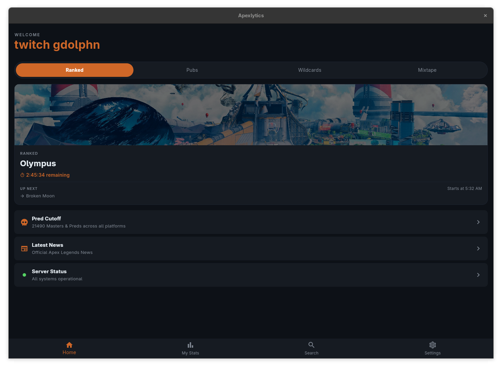
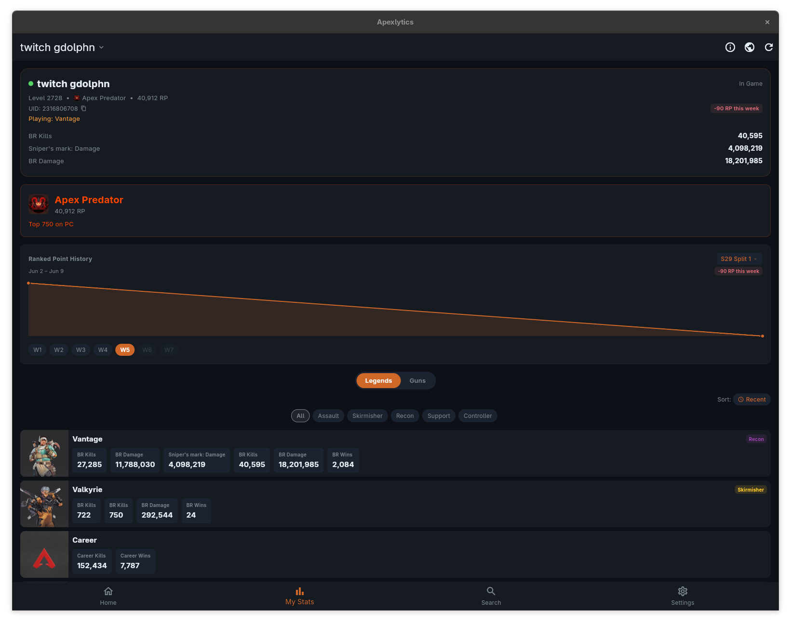
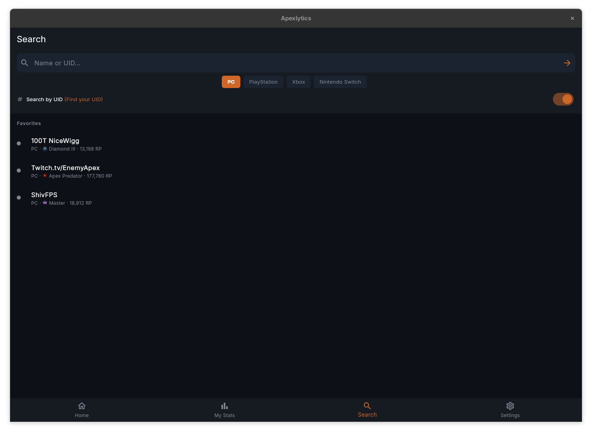
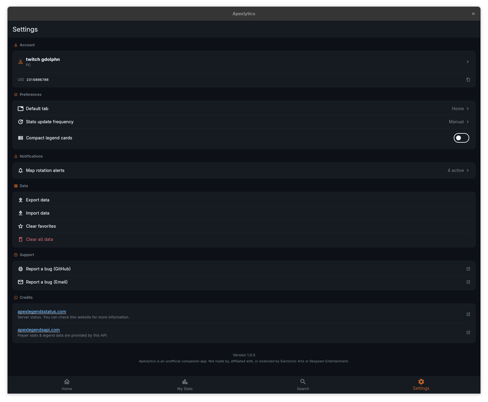

# Apexlytics

<p align="center">
  
</p>

<p align="center">
  <strong>Know the map. Track your grind. Get alerts. Your Apex sidekick.</strong><br/>
</p>

<p align="center">
  <a href="https://github.com/ajwadtahmid/Apexlytics/releases">
    
  </a>
  <a href="https://github.com/ajwadtahmid/Apexlytics/releases">
    
  </a>
  <a href="https://flutter.dev">
    
  </a>
  <a href="https://github.com/ajwadtahmid/Apexlytics/blob/main/LICENSE">
    
  </a>
  
  
  
  
</p>

---

<div align="center">

<a href="https://github.com/ajwadtahmid/Apexlytics/releases">
</a> 

<a href="https://play.google.com/store/apps/details?id=com.ajwadtahmid.apexlytics">
</a>

<a href="https://apps.apple.com/app/id6778521764">
</a>

</div>

---

## Overview

Track your ranked grind and visualize your RP gains with interactive graphs. Get instant map alerts, compare your stats with friends and rivals, and put all the data that matters at your fingertips with **Apexlytics**.

## Table of Contents

- [Key Features](#key-features)
- [Screenshots](#screenshots)
- [Features](#features)
- [Downloads](#downloads)
- [Development](#development)
- [Data & Privacy](#data--privacy)
- [Support & Feedback](#support--feedback)
- [FAQ](#faq)
- [Known Limitations](#known-limitations)
- [Changelog](#changelog)
- [Credits & Acknowledgments](#credits--acknowledgments)
- [License](#license)

---

### Key Features

- **Know the Map** — See which map is active now and preview upcoming rotations. Get instant notifications before the map changes so you're never caught off-guard mid-game.

- **Track Your Grind** — Look up any player's rank and legend statistics. Visualize your weekly RP gains with interactive graphs and compare head-to-head performance with other players across ranked seasons and splits.

- **Ranked Breakdown** *(limited availability)* — A full deep-dive into your ranked performance: match history, RP chart, per-map and per-legend breakdown tables, time-of-day performance, and highlight cards for your best and worst maps. Currently available to a small number of users.

- **Favorite Players & Compare** — Add players to your favorites and track their RP progression in real-time. Compare your stats side-by-side with favorited players to monitor competition and benchmark your climb.

- **Detailed Legend Stats** — Deep-dive into legend performance with advanced metrics including damage per kill, win rate, revive rate, and more custom stats. Analyze what's working and optimize your legend pool.

- **Server Status** — Check latency across regions at a glance.

- **Fast & Simple** — Instant access to the competitive data you need. No waiting, no friction.


> **Disclaimer:** Unofficial fan project. Not made by, affiliated with, or endorsed by Electronic Arts or Respawn Entertainment. Apex Legends is a trademark of Electronic Arts Inc.

---

## Screenshots

| Home | Stats | Search | Settings |
|------|-------|--------|----------|
|  |  |  |  |

---

## Features

- **Player Stats** — Rank, RP, current legend, equipped trackers, and weekly RP gain tracking. Supports search by name or numeric UID.
- **Weekly Ranked History** — Interactive graph showing RP gains per week with season/split selector and week-by-week navigation. Tracks unlimited snapshots for power users playing 10+ matches daily.
- **Ranked Breakdown** *(requires active player profile)* — Full ranked deep-dive: match list, RP chart, per-map and per-legend breakdown tables, time-of-day performance chart, sessions summary, and highlight cards for best/worst map. Auto-refreshes every 10 minutes while the app is open.
- **Legend Stats** — Kill counts and tracker values per legend, merged across sessions and sorted by most-played.
- **Gun Stats** — Detailed weapon performance including kills, damage, and damage per kill.
- **Map Rotations** — Live countdown for Ranked, Pubs, and Mixtape. Shows current map, time remaining, and what loads next. Switches automatically when the rotation changes.
- **Predator Cutoff** — Current minimum RP to reach Apex Predator on PC, PlayStation, Xbox, and Switch.
- **Server Status** — Health of Origin Login, EA Accounts, Nova Fusion, and Apex Crossplay. Drill down to see per-region latency in milliseconds, color-coded green/orange/red.
- **Latest News** — In-game news feed from the official Apex feed.
- **Player Compare** — Side-by-side comparison of ranked stats or per-legend trackers with any searched player.
- **Favorites** — Star players to pin them to the search screen for one-tap access.
- **Multiple Player Profiles** — Manage and quickly switch between different player profiles. Perfect for tracking friends, alternate accounts, or monitoring competition.
- **Map Rotation Alerts** — Get notified 5, 10, or 15 minutes before the map changes in-game. Choose which maps to be notified about (ranked, pubs, mixtape). Notifications include the exact map change time and date.
- **Selective Mode Tracking** — Choose which modes to monitor: Ranked, Pubs, Mixtape.
- **Background Notifications** — Alerts are batch-scheduled ahead of time and fire even when the app is closed (via background fetch on iOS/Android).
- **View Cached Stats Offline** — All player stats are cached locally on your device. Search for a player online, and their stats remain accessible even without internet—perfect for checking during downtime.
- **No account required** — Data is fetched using your public in-game name or UID.
- **Data Backup & Restore** — Export your player profiles, favorites, and tracked data as a backup file. Restore from backup anytime to recover your data or switch devices seamlessly.
- **Dark theme** — Designed for low-light gaming sessions.

---

## Development

### Requirements

| Tool | Version |
|------|---------|
| Flutter SDK | 3.x (stable channel) |
| Dart SDK | bundled with Flutter |
| Android: Java | 17 |
| iOS/macOS: Xcode | 15+ |
| Linux: GTK | `libgtk-3-dev` |

### Quick Start

```bash
# 1. Clone
git clone https://github.com/ajwadtahmid/Apexlytics.git
cd Apexlytics

# 2. Install dependencies
flutter pub get

# 3. Copy environment file
cp .env.example .env

# 4. Update .env with your credentials
# Edit .env and set PROXY_URL and CLIENT_TOKEN (see Configuration below)

# 5. Generate env code
dart run build_runner build --delete-conflicting-outputs

# 6. Run
flutter run
```

### Configuration

The app proxies all API calls through a private server instead of calling APIs directly (keeps credentials and tokens secure on the backend). You'll need to set up a proxy server that implements the endpoints below.

```env
# .env
PROXY_URL=https://your-proxy-server.example.com
CLIENT_TOKEN=your-secret-token
```

After editing `.env`, regenerate:

```bash
dart run build_runner build --delete-conflicting-outputs
```

#### Required Endpoints

Your proxy server must implement these endpoints:

- **`GET /maprotation`** — Returns current and next map rotations for Ranked, Pubs, Mixtape, and Wildcards
- **`GET /player/:platform/:playerName`** — Returns player stats (rank, RP, legend data, trackers)
- **`GET /predator`** — Returns current Apex Predator RP cutoff per platform
- **`GET /servers`** — Returns server status (login, EA accounts, crossplay health)
- **`GET /news`** — Returns official Apex Legends news feed

All requests must include the `x-client-token` header with your `CLIENT_TOKEN` value.


## Data & Privacy

- **No login, no account.** All data is public (player stats are visible on apexlegendsstatus.com).
- **No analytics or tracking.** The app does not collect or send any user data.
- **Local-only storage.** Cached responses and snapshots are stored on-device only.

Data is sourced from [apexlegendsstatus.com](https://apexlegendsstatus.com) and [apexlegendsapi.com](https://apexlegendsapi.com).

---

## Support & Feedback

Have a question or found a bug? Let us know:

- **Email**: [support@ajwadtahmid.com](mailto:support@ajwadtahmid.com)
- **Bug reports & features**: [GitHub Issues](https://github.com/ajwadtahmid/Apexlytics/issues)
- **Ideas & discussions**: [GitHub Discussions](https://github.com/ajwadtahmid/Apexlytics/discussions)

---

## Changelog

Full release history and notes are available on the [GitHub Releases](https://github.com/ajwadtahmid/Apexlytics/releases) page.

---

## Credits & Acknowledgments

Special thanks to:

- **[Hugo Derave](https://github.com/HugoDerave)** — Developer and maintainer of the [Unofficial Apex Legends API](https://apexlegendsapi.com/), which powers player stats lookups, map rotation data, and server status for this app
- **[Apex Legends Status](https://apexlegendsstatus.com/)** — Provides real-time server status, map rotation data, and players stats with comprehensive ranked stats, leaderboard for ranked along with all trackers and so much more

This project would not be possible without these amazing resources and the developer behind them.

---

## FAQ

**Q: Is this app affiliated with Respawn/EA?**
No, this is an unofficial fan project. This app is not affiliated with Respawn or EA in any way. This just uses the API provided by apexlegendsapi.com to display player stats, map information, and other game data.

**Q: How often is player data updated?**
Player stats are fetched fresh from the API when you search. Cached data is available offline but may be stale.

**Q: Will my account be compromised?**
The app doesn't store your account credentials. You only provide a player name or UID, which are public information visible on apexlegendsstatus.com.

**Q: Can I track multiple players at once?**
Yes, add players to favorites for quick access. You can also compare stats with any player.

**Q: How reliable is the API?**
The app depends on [apexlegendsapi.com](https://apexlegendsapi.com/) and [apexlegendsstatus.com](https://apexlegendsstatus.com/). These services are community-run and may experience occasional downtime. The app gracefully falls back to cached data when APIs are unavailable.

**Q: What platforms are supported?**
Android, iOS, Windows, and Linux.

**Q: Do I need to create an account?**
No. Just search for any public player by name or UID.

---

## Known Limitations

- **RP snapshots** — Only tracks if app is open and sync is completed. RP gains when app is closed are not captured.
- **Legend stats** — Tracker names and values are as reported by the Apex Legends Status API; custom or seasonal tracker names may not be fully supported.
- **Predator cutoff** — Updates each hour. Doesn't refresh automatically; manual refresh required to see latest cutoff.
- **Offline player search** — If a player hasn't been searched before, their data won't be cached and you'll need internet to look them up.

---

## License

[GNU General Public License v3.0](LICENSE)

---

*This project is rebranded from [Apex Legends Nexus](https://github.com/ajwadtahmid/ApexLegendsNexus).*
